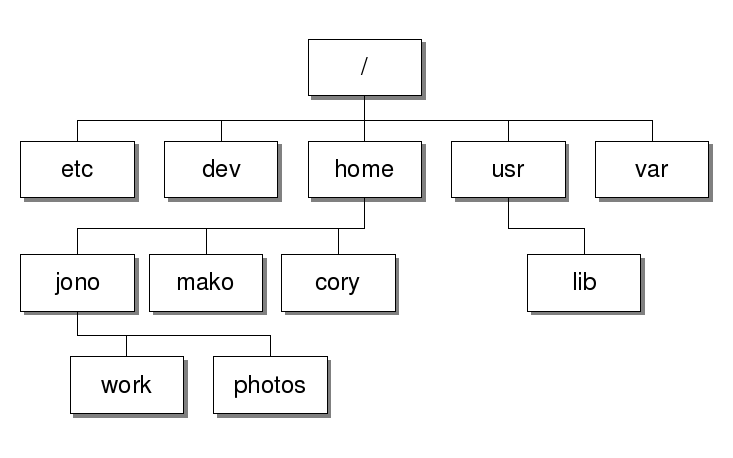

:tip-caption: 💡
:note-caption: 📝
:caution-caption: ⚠️
:warning-caption: 🔥
:important-caption: ❗️

= The Ultimate Guide to Using the Shell
:toc: left
:experimental:
:commandkey: &#8984;
:optionkey: &#8997;
:shiftkey: &#x21e7;
:ext-relative: adoc
:imagesdir: ./images

*GOAL: Learn how to manage files and processes with the shell.*

This will be accomplished by performing the following tasks:

. Running a shell process in the terminal
. Navigating the filesystem
. Handling Files
. Handling Processes

== What is the Shell?

Inspired by the original UNIX operating system, *the trademark feature of all UNIX-like operating systems is the shell*. Common Unix-like operating systems include macOS and any distribution of Linux. Check out this awesome video to learn more about the original UNIX shell: 

video::tc4ROCJYbm0[youtube, width=600, height=400, align=center]

=== Files and Processes

Everything in a Unix-like operating system is a *file*. A speical type of files called *executable files* become *processes*. Processes occur anytime we run a program by executing an *executable file*. 

|===
|*EXECUTABLE files (become processes)*|*NON EXECUTABLE files (rely on processes)*
|

Type of file that runs a program when it's opened by executing a set of instructions (a.k.a. do stuff like listen to songs, watch videos or view images) based on compiled programs/scripts

Common examples: Spotify, Web Browsers (Safari, Firefox, Chrome), Microsoft Word/PowerPoint/Excel, *commands*

Common file extensions: .APP .EXE .SRC .VB|

Type of file that relies on executable files to be of any use 

Common examples: audio files, compressed files, data files, system files, Word/PowerPoint/Excel files

Common file extensions: .mp3, .mpg, .jpg, .png, .doc, .ppt, .xsl, .tar, .log )
|===

== Running a shell process with the terminal
*GOAL: Learn how to use the terminal to run commands in the shell.*

We run shell commands to tell the computer what to do. But to write out the commands, we need to use a command-line interface called the terminal. 

* *Exercises, resources and troubleshooting*: terminal, shell, and command-line basics
+
xref:running-a-shell-process-terminal.adoc[here]. 

////
 What's the difference between the terminal and the shell?
* How do I open the terminal?
* What are commands?
* What is the command-line prompt?
* How do I run commands?
////

* *Quick Reference:* run commands like a boss
+
. kbd:[tab]: Auto-complete (commands, file names)
. `$ history` or kbd:[&uarr;]: Recall command history
. kbd:[ control + u]: Clear the command line
. `$ clear` or kbd:[ control + L]  Clear the screen
. kbd:[control + c]: Kill a process/cancel input (begin a new command line)
. kbd:[ control + z]: stop a process

== Navigating the filesystem

*GOAL: Learn how to navigate the filesystem using the shell.* 

Everything stored on a computer's hard drive is a file (even DIRECTORIES [a.k.a. folders]). In Unix-like OSs, *filesystems* have a hierarchical structure analogous to an upside down tree. All files and directories within the filesystem,have have a direct path that leads back to the *root* *directory* (written as a slash /). Subtle differences exist depending on the OS, but they all have the same general structure.

[.float-group]
--
[.left]
.macOS filesystem architecture
image::image-macOStree.png[120,180]

[.left]
.Linux distribution architecture

--

=== Where am I? (Listing Things)

* *Exercises, troubleshooting and resources*:
+
Click xref:listing-things.adoc[here].

* *Quick Reference*: List things like a boss.

* `pwd`: Print current working directory
* `ls`: List all the files
* `ls -l`: List all the files, permissions and last edit time
* `ls -1`: List all the files, one per line
* `ls -a`: Include hiddent files
* `ls -F`: List file types

=== Moving Around (Changing Directories)
* *Exercises, troubleshooting, and resources*:
+
Click xref:going-places.adoc[here].

* *Quick Reference*: Move around like a boss.
+
NOTE: Typing `cd` with no argument always returns you to your home directory on Unix-like systems. This is super helpful if you're lost in the filesystem. +
In Windows, you'll want to use `cd ~` instead.
+
* `cd _/my/desired/location_`: changes directories to desired location
* `cd`: go to your home directory
* `cd ~`: go to your home directory
* `cd ..`: go up one directory
* `cd ../..`: go up two directories

=== Reading Things

* `cat _file.txt_` Print a file to the terminal
* `more _file.txt_`: Scroll through a file
* `less _file.txt_`: Scrolls through a file (going backwords allowed)
* `head -n 7`: Print the first 7 lines of a file
* `tail -n 7`: Print the last 7 lines of a file
* `wc _file.txt_`: Word count
* `wc -w _file.txt_`: Figure out how many words
* `wc -l _file.txt_`: Figure out how many lines
* `diff`

=== Searhing for Things

* `grep` (don't ask why it's called grep): filters for things that you print 
* `find`: will search for a specified file
//* `locate?`//

== Handling files

*GOAL: Make changes to the filesystem using the shell.*

=== Making things

IMPORTANT: Don't use special characters or spaces... EVER. If you do somehow end up with a filename with special characters or spaces, put it in quotes or single quotes when referencing it. (Example: 'file name.txt')

NOTE: acceptable characters: dash - underscore _ or forward slash /

==== Making Files

* `touch _file.txt_`: Make a text file called file
* `nano _file.txt_` or `vim _file.txt_` or `emacs _file.txt_`: Make and/or edit a text file called file

==== Making Directories

* `mkdir _directory_`: Make a directory 
* `mkdir-p _directory1/directory2_`: Make a directory (directory1) and a subdirectory (directory2)

=== Copying Things

* `cp _file.txt /directory/_`: Copy a file to a location
* `cp -r _directory1 /directory2/_`: Make a copy a directory into another directory

=== Moving Things

* `mv _directory1/file /directory2/_`: move a file from one directory into another directory

=== removing things

CAUTION: Proceed with care - you can really screw things up

NOTE: Files are backed up, but let's not go there

* `rm _file_`: remove a file
* `rmdir _directory_`: remove an (empty) directory
* `rm -r _directory_`: remove a directory and everything within it

=== Permissions

* changing groups
* changing permissions
* adding sticky bits

== Handling Processes

*GOAL: Manage processes using the shell.*

* `jobs`: Display status of current processes in shell
* `bg`:  Resume a stopped process in the background so you can enter more commands
* `fg`: Resume a stopped process by running in the foreground (can't enter more commands this way)
* `kill`: Kill a running or stopped process
* `stop`: Stop a running process

---
*Miscellaneous* 

* `echo "_Hello World_"`: Prints hello world to the terminal
* `sed`: Replaces things for you
* `awk`: Will let you print specific fields of data (columns)
* `bc`: Doing math is easier in bash scripts if you pipe it through bc
* `cut`: Tool for chopping up strings
* `uniq`: Gets rid of duplicate things
* `sort`
* `paste`
* `clear`: Clear screen
